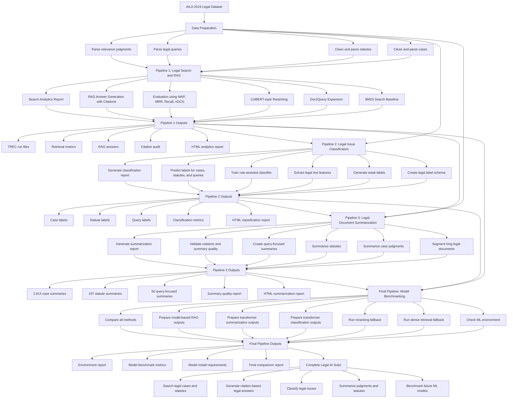

# DL Legal AI Project: Simple Flowchart

This project builds an AI system for the legal domain using the AILA 2019 dataset.

The dataset contains:

- 2,914 Indian Supreme Court case documents
- 197 legal statutes
- 50 legal situation queries
- Ground-truth relevance judgments for evaluation

## Simple Project Flowchart

## What We Built In Simple Words

### Pipeline 1: Legal Search and RAG

This pipeline searches relevant prior cases and statutes for a legal query.  
It also generates citation-based legal answers using retrieved documents.

Main outputs:

- TREC retrieval run files
- Evaluation metrics
- RAG answers
- Citation audit
- Analytics report

### Pipeline 2: Legal Issue Classification

This pipeline assigns legal issue labels to cases, statutes, and queries.

Example labels:

- Criminal law
- Constitutional law
- Property law
- Contract law
- Evidence law
- Writ jurisdiction
- Statutory interpretation

Main outputs:

- Case predictions
- Statute predictions
- Query predictions
- Classification metrics
- Classification report

### Pipeline 3: Legal Summarization

This pipeline creates readable summaries of legal documents.

It summarizes:

- 2,914 case documents
- 197 statutes
- 50 query-focused legal situations

Main outputs:

- Case summaries
- Statute summaries
- Query-focused summaries
- Citation validation report
- Summarization analytics report

### Final Pipeline: Model Benchmarking

This pipeline prepares the project for advanced ML and transformer models.

It checks whether libraries like PyTorch, Transformers, Sentence Transformers, FAISS, and ColBERT are installed.  
Because they are not currently installed, it runs fallback versions and saves installation instructions for future upgrades.

Main outputs:

- Environment readiness report
- Model benchmark run files
- Model benchmark metrics
- Final comparison report
- Requirements file for future model installation

## Final Result

The project is now a complete Legal AI suite with:

- Legal information retrieval
- RAG-based legal answer generation
- Legal issue classification
- Legal judgment summarization
- Model benchmarking for future deep learning upgrades

